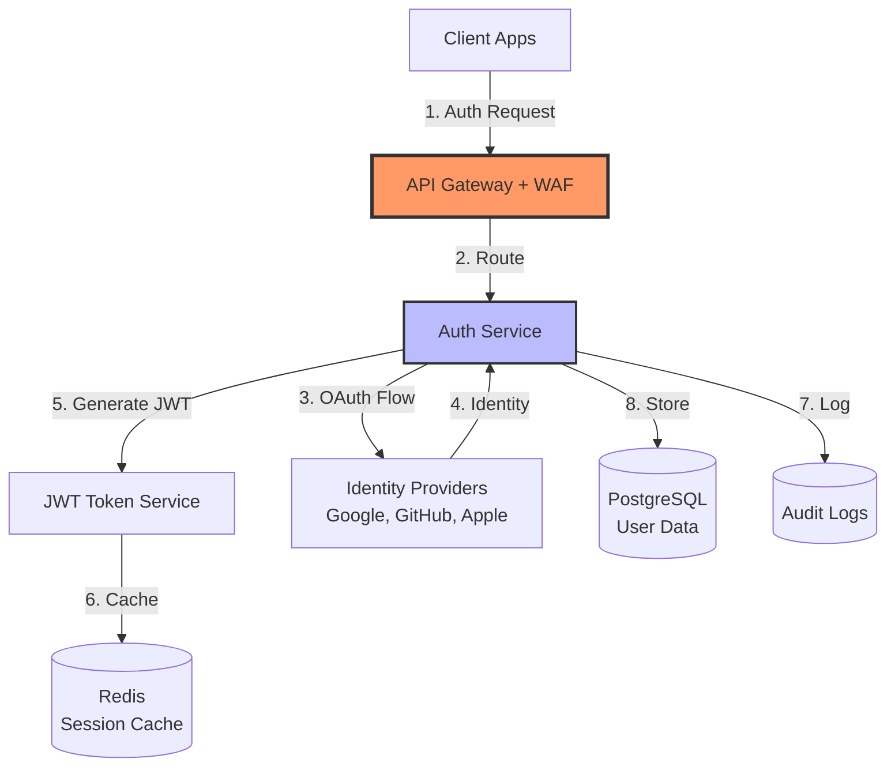
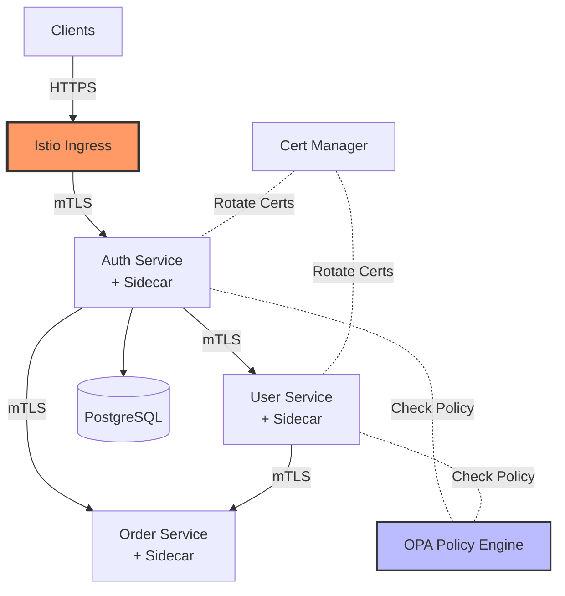
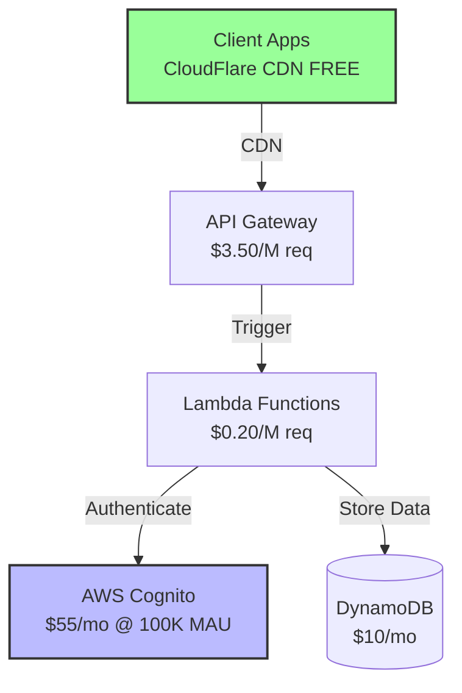
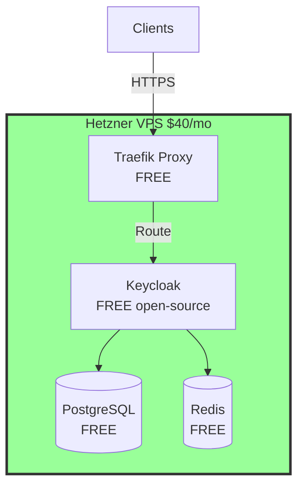
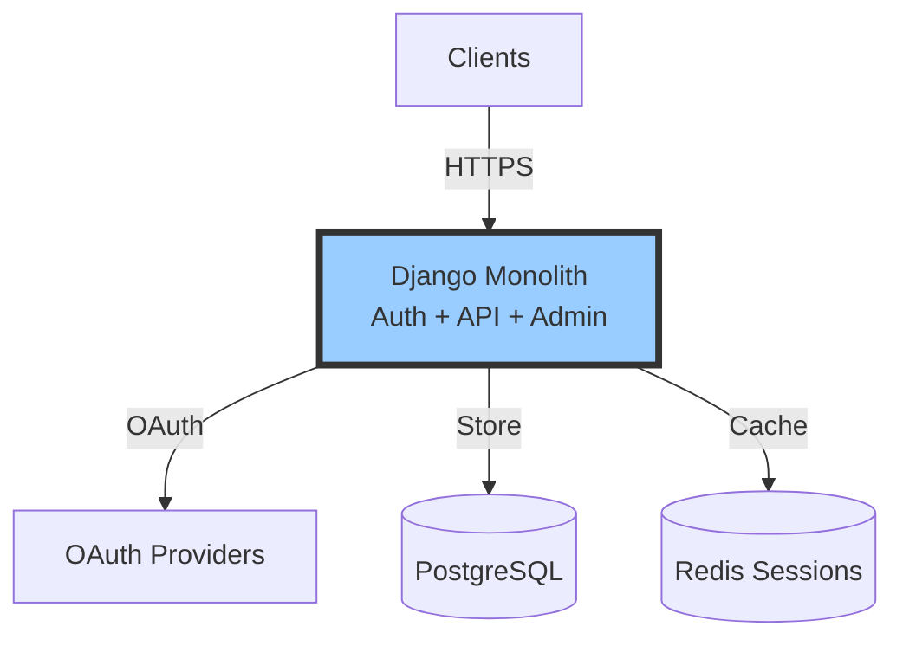
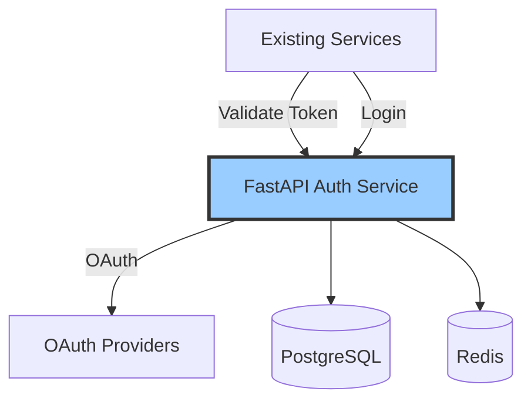

# Brainstorming Round 1 - Authentication Service Architecture
**Session**: microservices-auth  
**Timestamp**: 2026-01-22 16:00:00  
**Round**: 1 of 3  
**Phase**: Initial Exploration

---

## Best Practices Agent - Round 1

### Proposal 1: Centralized Auth Gateway with Identity Federation

**Rationale**: 
Implements OAuth2/OIDC standards with API Gateway pattern for centralized authentication:
- **API Gateway Pattern**: Single entry point for all auth requests
- **Identity Federation**: Standard OIDC integration with external providers
- **JWT Token Service**: Stateless authentication following RFC 7519
- **Audit Logging**: GDPR/SOC2 compliance built-in

**Key Features**:
- Centralized OAuth2 gateway handling all identity provider integrations
- JWT token issuance with short TTL (15min) and refresh token rotation
- Redis-backed session management with 5-minute cache TTL
- Rate limiting at gateway layer (1000 req/min per IP)
- Comprehensive audit logs for compliance

**Architecture Diagram**:

**Timestamp**: 2026-01-22 16:00:00

**Scalability Path**:
- **MVP** (10K users): Single auth service + Redis, handles 500 req/s
- **Growth** (100K users): Horizontal scaling (3-5 instances), Redis Cluster
- **Scale** (1M+ users): Multi-region deployment, CDN, auto-scaling groups

**Best Practices Checklist**:
- ✅ OAuth2/OIDC Standards (RFC 6749, RFC 7519)
- ✅ API Gateway Pattern
- ✅ Defense in Depth (WAF, rate limiting, encryption)
- ✅ Audit Logging (compliance ready)
- ✅ Stateless Authentication (horizontal scalability)

---

### Proposal 2: Service Mesh with Mutual TLS Authentication

**Rationale**:
Zero-trust architecture using Istio service mesh:
- **Service Mesh Pattern**: Infrastructure-level authentication
- **Mutual TLS**: Certificate-based service-to-service auth
- **Policy as Code**: Centralized authorization with OPA
- **Automatic Certificate Rotation**: Operational excellence

**Key Features**:
- Istio handling mTLS automatically between all services
- Centralized policy engine (Open Policy Agent) for RBAC
- User auth via dedicated service, service auth via certificates
- Automatic cert rotation every 24 hours
- Distributed tracing built-in

**Architecture Diagram**:

**Timestamp**: 2026-01-22 16:00:00

**Scalability Path**:
- **MVP**: 5 services with Istio, complexity managed by platform
- **Growth**: Add services without auth code changes
- **Scale**: Multi-cluster mesh, global load balancing

**Best Practices Checklist**:
- ✅ Service Mesh Pattern
- ✅ Zero Trust Architecture
- ✅ Mutual TLS (encryption + authentication)
- ✅ Policy as Code (OPA)
- ✅ Automatic Certificate Management

---

## Cost-Effective Agent - Round 1

### Proposal 3: Serverless Auth with Managed Services

**Rationale**: 
Minimize infrastructure costs using serverless and managed services:
- **AWS Lambda**: Pay-per-request ($0.20/M requests), zero idle costs
- **AWS Cognito**: Managed auth service ($0-55/month for 100K MAU)
- **CloudFlare**: Free CDN and DDoS protection
- **DynamoDB**: Free tier 25GB, pay-as-you-go after
- **No server maintenance**: Fully managed infrastructure

**Cost Analysis**:

| Category | Initial Setup | Monthly (100K users) | Scaling (1M users) |
|----------|---------------|----------------------|---------------------|
| Compute (Lambda) | $0 | $50 | $480 |
| Auth (Cognito) | $0 | $55 | $550 |
| Storage (DynamoDB) | $0 | $10 | $120 |
| Network (CloudFlare) | $0 | $0 | $0 |
| **Total** | **$0** | **$115/mo** | **$1,150/mo** |

**Architecture Diagram**:

**Timestamp**: 2026-01-22 16:00:00

**ROI Justification**:
- **Time to MVP**: 3-4 weeks (managed services accelerate development)
- **Developer productivity**: Save 40 hours on infrastructure setup
- **Avoided costs**: No DevOps engineer for first year ($120K saved)
- **Cost per user**: $0.00115/user/month (100K users)

**Key Cost Optimizations**:
- CloudFlare free tier: Saves $150/mo vs CloudFront
- Cognito vs custom: Saves ~80 hours dev time ($6K)
- Serverless: No idle server costs (~$200/mo saved)
- **Total Monthly Savings**: $350/mo vs traditional approach

---

### Proposal 4: Open-Source Self-Hosted (Keycloak)

**Rationale**:
Maximum cost efficiency with open-source tools:
- **Keycloak**: Free, open-source identity management
- **Single VPS**: Hetzner Cloud ($40/mo for 8GB)
- **PostgreSQL**: Included, no managed DB costs
- **Traefik**: Free reverse proxy with auto-SSL
- **Zero licensing fees**: All open-source stack

**Cost Analysis**:

| Category | Initial Setup | Monthly (100K users) | Scaling (1M users) |
|----------|---------------|----------------------|---------------------|
| Compute (VPS) | $0 | $120 (3 servers) | $600 (load balanced) |
| Storage | $0 | $15 (backups) | $80 (backups + logs) |
| Network | $0 | $0 (included) | $25 (extra bandwidth) |
| Software | $0 | $0 (open-source) | $0 |
| **Total** | **$0** | **$135/mo** | **$705/mo** |

**Architecture Diagram**:

**Timestamp**: 2026-01-22 16:00:00

**ROI Justification**:
- **Time to MVP**: 4-5 weeks (self-hosting requires setup)
- **Annual savings**: $2,880/year vs managed services
- **Cost per user**: $0.00135/user/month (100K users)
- **Trade-off**: 1 week more dev time vs long-term savings

**Key Cost Optimizations**:
- Hetzner vs AWS: 60% cheaper compute
- Keycloak vs Auth0: Saves $300+/mo
- Self-hosted PostgreSQL: Saves $50/mo
- **Total Monthly Savings**: $400/mo vs commercial stack

---

## Simplicity Agent - Round 1

### Proposal 5: Django Monolith with django-allauth

**Rationale**:
Minimal complexity using battle-tested framework:
- **Django Framework**: Auth built-in, admin panel included
- **django-allauth**: 40+ OAuth providers out-of-box
- **Single Codebase**: All auth logic in one place
- **Monolithic Deployment**: Simple to understand and debug
- **PostgreSQL**: Single database, no distributed data

**Simplicity Metrics**:

| Metric | Value |
|--------|-------|
| **Components** | 3 (Django, PostgreSQL, Redis) |
| **Dependencies** | 2 (django-allauth, psycopg2) |
| **Languages** | 1 (Python) |
| **Learning Curve** | Low (1-2 weeks for Python devs) |
| **Complexity Score** | 2/10 |

**Architecture Diagram**:

**Timestamp**: 2026-01-22 16:00:00

**What Makes This Simple**:
- **One Codebase**: Auth in `authentication/` directory, easy to find
- **Django Admin**: User management UI built-in
- **django-allauth**: OAuth config in settings.py, no custom code
- **Standard Patterns**: Django conventions everyone knows

**Team Capacity**:
- **Developers needed**: 2 (your current team)
- **Skill level**: Mid-level Python developers
- **Onboarding**: 1-2 weeks
- **On-call burden**: Low (Django errors are clear)

**Avoided Complexities**:
- ❌ Microservices coordination
- ❌ Service mesh overhead
- ❌ Distributed tracing
- ❌ Complex deployment pipelines

---

### Proposal 6: FastAPI Microservice with OAuth2 Library

**Rationale**:
Lightweight Python microservice focused only on auth:
- **FastAPI**: Modern, fast framework (300ms → 50ms responses)
- **python-jose**: JWT handling built-in
- **httpx**: Async OAuth requests
- **Single Service**: Auth only, integrates with existing services
- **Minimal Dependencies**: 5 core libraries

**Simplicity Metrics**:

| Metric | Value |
|--------|-------|
| **Components** | 4 (FastAPI, PostgreSQL, Redis, OAuth proxies) |
| **Dependencies** | 5 (FastAPI, python-jose, httpx, sqlalchemy, redis-py) |
| **Languages** | 1 (Python) |
| **Learning Curve** | Low (FastAPI docs excellent) |
| **Complexity Score** | 3/10 |

**Architecture Diagram**:

**Timestamp**: 2026-01-22 16:00:00

**What Makes This Simple**:
- **Single Responsibility**: Only handles authentication
- **FastAPI Magic**: Auto-generated docs, validation, async
- **Standard Libraries**: python-jose for JWT (well-documented)
- **Easy Integration**: REST API other services can call

**Team Capacity**:
- **Developers needed**: 2
- **Skill level**: Mid-level Python
- **Onboarding**: 1 week
- **On-call burden**: Low (single service to monitor)

**Avoided Complexities**:
- ❌ Service mesh
- ❌ Complex build pipelines
- ❌ Multiple languages
- ❌ Heavy frameworks (Spring, .NET)

---

## Round 1 Summary

**Total Proposals Generated**: 6  
**Perspectives Covered**: 3 (Best Practices, Cost-Effective, Simplicity)  
**Diagrams Created**: 6 (all timestamped)  

**Proposal Overview**:
1. **Centralized Auth Gateway** - Best practices, proven patterns
2. **Service Mesh + mTLS** - Zero trust, infrastructure auth
3. **Serverless + Cognito** - Lowest cost managed ($115/mo)
4. **Keycloak Self-Hosted** - Lowest total cost ($135/mo), open-source
5. **Django Monolith** - Simplest (2/10 complexity)
6. **FastAPI Microservice** - Simple focused service (3/10 complexity)

**Next**: Synthesize results and select top 3 for debate phase
