# Reminders
	- #meeting PO Form Setting: Item Setting Re-organisation
	  id:: 69644daa-4699-4996-85a4-9daa3d45a2f9
	  :LOGBOOK:
	  CLOCK: [2026-01-12 Mon 09:33:44]--[2026-01-12 Mon 09:34:00] =>  00:00:16
	  CLOCK: [2026-01-12 Mon 09:34:01]--[2026-01-12 Mon 09:34:32] =>  00:00:31
	  CLOCK: [2026-01-12 Mon 09:34:33]
	  :END:
		- Objective
			- Discuss & finalize the item setting reorganisation stated in the `Item Information Part2` section of https://supplycart.atlassian.net/browse/ST-13282
			- DONE @nadzmi to check again how the re-structuring of the item config should be done #q&a
		- Current Status
			- We want to change the `Item Configuration` sub-section from:
			  collapsed:: true
				- 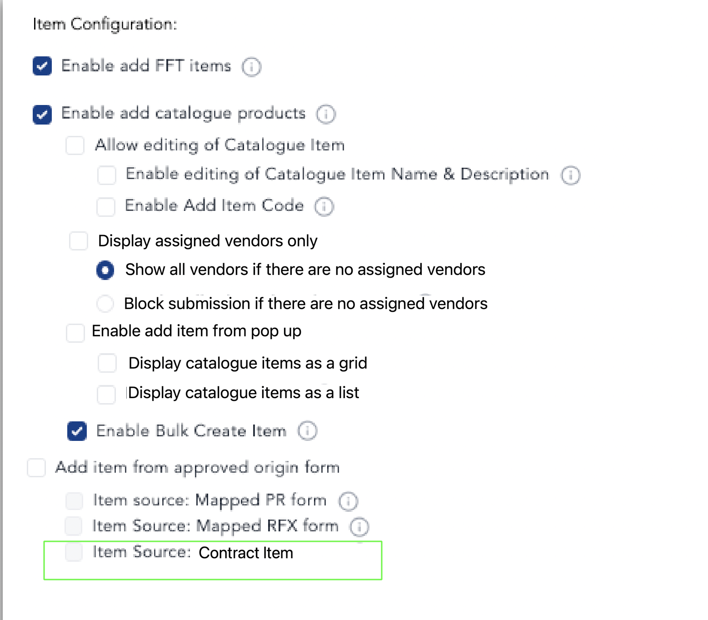{:height 424, :width 462}
			- To the below:
			  collapsed:: true
				- [] Enable add FFT
				- [] Enable add catalogue products
					- [] Enable editing of Catalogue Item Name
					  id:: 6965e7bc-1d0d-437e-b3b9-4752bf192a94
					- [] Enable editing of Catalogue Item Description
					- [] Enable add Item Code
				- [] Enable assigned vendor (to product)
					- () show all
					- () show assigned
						- [] block submission
				- [] Enable item from approved origin
			- ## **UPDATED**
				- Enable add FFT
				- 1. [ ] Show assigned vendor
					- a. ( ) Allow all vendor when none assigned
					- b. ( ) Only allow assigned vendor
				- 2. [ ] Pull price from catalogue?
				- 3. Enable add item from popup
					- Display catalogue item as grid
					- Display catalogue item as list
				- 4. Enable bulk create item
- # Acceptance Criteria
  collapsed:: true
	- [[Form Setting Splitting]]
	  logseq.order-list-type:: number
		- **Global PO Form Setting** page = The current `Purchase Order: Purchase Orders Settings` page
		- **Individual PO Form Setting** page = The page after user clicked on the `More Settings` from the `Purchase Order: Purchase Orders Settings` page
	- [[Reorganise PO Settings]]
	  logseq.order-list-type:: number
		- Some fields from **Global PO Form Setting** will be moved into **Individual PO Form Setting**
		  logseq.order-list-type:: number
- ## Q&A
	- DONE What is the main difference between Global PO Setting & Individual PO Setting?
	  collapsed:: true
		- | Global PO Setting | Individual PO Setting |
		  | --- | ---- |
		  | Feature toggle will affect existing PO (live change) | Feature toggle will only affect newly drafted PO |
		  | Changes will be set under global Company Setting | Changes will be set under PO Form Setting |
	- DONE For the `enable requestor to access PO Details page` setting, do we still use this? If yes, can anyone help me to understand how it works?
	  collapsed:: true
		- Yes, the user access the PO details page from the reference in PR details page
			- Can remove first `Enable Requestor to access PO Details` & see what modules are affected
		- DONE @Nadzmi to check & confirm what is the current flow for those companies that toggle this setting?
	- DONE Po acceptance not needed to split
	- DONE Regarding the `PO pull items from PR`, we don't have them yet
	  collapsed:: true
		- Currently the concept **PULL** are only being used by RFX
		- For PR, it **PUSH** item to create a new PO
	- DONE For the `Display Assigned Vendor Only` setting, why do we have the`Block` setting instead of making the vendor item selection fields compulsory?
	- DONE For `PO T&C` & `PO Email Text`, we no longer need the `Save` button, right?
- # Task Breakdown
	- ## [[Company & Form Setting Setup]] {{renderer :todomaster}}
	  collapsed:: true
		- #re-test **Hub/ADAM features page**
			- DONE #q&a Do we still need to add setting in HUB?
				- We already implemented the feature flag without using HUB at the moment
			- DONE #q&a What does it mean by this statement? **"Create new PO form setting (for switchover)"**
				- A: `switchover` here means when we switch from partial Multi PO implementation into full Multi PO implementation throughout **ADAM**
		- #re-test **Role & Permissions**
			- DONE #q&a The **"remain the same"** here means that all single PO's exis``ting permission applies to multi PO, right?
			  collapsed:: true
				- A: the **Remain the same** statement under the **Roles & Permissions** means that all Multi PO’s permission shares the same permission as existing Single PO
		- #re-test **User Form Assignment**
			- DONE we already implemented this in existing Multi PO & Single PO
	- ## [[Form Setting Splitting]] {{renderer :todomaster}}
	  collapsed:: true
		- ### Global PO Form Setting
			- #q&a From ticket `Context` section:
				- DONE What does **"for GROUPs"** & **PO Template** refers to?
				- ```
				  Context:
				  Previous understanding was that within a company, only ONE template for PO is ever used
				  
				  However, from our understanding, for GROUPs, each company may have a different PO template. Also, within a single company, there can be multiple PO types.
				  
				  For Lembaga Zakat Selangor, different PO types also have different approvals as some POs require management approvals, and others which have been pre-approved, can just be departmental approval
				  ```
				- A: Group here means that multi po will help in terms of making single po form setting to encapsulate different groups of companies' needs
		- ### Individual PO Form Setting
			- #re-test **PR** or **RFX** Form Settings can be routed to the different **PO** Form Settings
				- **PR**
					- DONE `Manual PR -> PO`
					- DONE `Auto PR -> PO`
				- **RFX**
					- DONE `RQ > RFX > PR`
					  id:: 695e10f2-48e5-49a3-8576-d02f932e6884
					- DONE `PR > RFX > PO`
			- #re-test Each PO will have GR & IR form attached
				- Answer to all the below questions:
					- it's not needed to add `Form Name` column for GR, RTN & PI moduel.
				- DONE #q&a We should add the `Form Name` column within both `Good Received (GR)` & `Purchase Invoice (PI) (PI)` similar to the `My Purchase Orders` & `Company Purchase Order` listing page
					- DONE If yes, then  Export Submission CSV should also be affected since we need to add a new column
					- DONE Seems like `PI` listing page does not have CSV export
				- DONE #q&a This will affect the search query within `GR` & `PI` listing page?
				- DONE #q&a Do we need to add filter dropdown for PO Form Setting within  `GR` & `PI` listing page?
				- DONE #q&a We should also apply the same thing within `Good Returns (GRN)` listing page including the filter & search function?
			- #re-test Each PO form can be revised or **issued** and sent to a different approval flow
				- DONE #q&a Does the word `issued` here are synonymous to `created` PO?
			- #re-test Create new Form
				- Type of PO form
			- #re-test History Logs
				- Form Creation
				- Form Deletion
				- Form Name Change
				- Form Details change
	- ## [[Reorganise PO Settings]] {{renderer :todomaster}}
		- ### Global PO Form Setting
		  id:: 695df31d-f53a-450c-8235-f4a73fe16036
		  collapsed:: true
			- #re-test Internal Source
				- DONE figure out how it work in BE
			- PO Acceptance
				- DONE #q&a Is this referring to a scenario where vendor is accepted?
					- **Answer** yes
				- DONE #tanya-ben For the “PO Acceptance“ feature, do we not need to separate them into it’s own individual PO setting?
					- **Answer** NO
			- Enable Requestor to access PO Details
				- DONE #q&a #tanya-ben Is this still used?
					- **Answer**
						- Yes, still used.
						- From PR details page, requester will access PO details page through the internal source reference.
			- #re-test Revise & Edit PO
				- DONE Enable Revise PO
				- DONE Require Approval for Lower Revision Sum
					- **Revision Sum** = total item cost
					- By default all revise PO that has higher **Revision Sum** require approval
				- DONE Enable Revise on POs that have GR activity on them
				- DONE Enable Edit PO
				  :LOGBOOK:
				  CLOCK: [2026-01-07 Wed 16:07:55]--[2026-01-15 Thu 16:15:01] =>  192:07:06
				  :END:
			- #re-test Company PO Page filters
				- DONE check again with both @sim & @ben since we've implemented Filtering for `Form Name`
			- #re-test Closing Po
				- DONE Enable Goods Received Closing
				- DONE Enable Extra Receiving Quantity
				  collapsed:: true
					- | Toggle | Screenshot |
					  | --- | --- |
					  | **Enabled** | 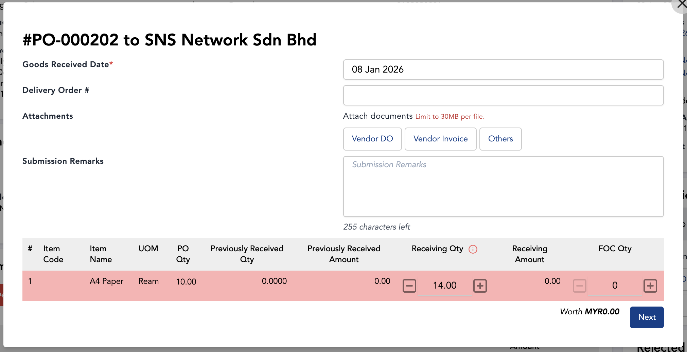{:height 254, :width 531} |
					  | **Disabled** | 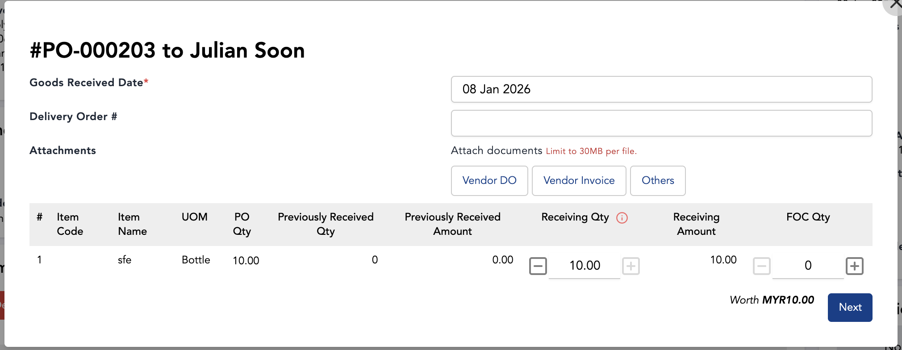{:height 168, :width 536} |
				- DONE Enable FOC Quantities
				  collapsed:: true
					- | Toggle | Screenshot |
					  | --- | --- |
					  | **Enabled** | 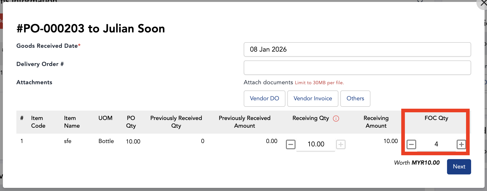 |
					  | **Disabled** | 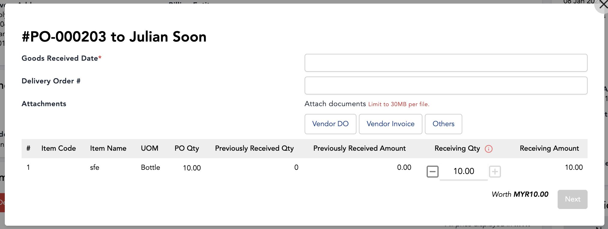 |
				- DONE Enable Invoice Received Closing
				  collapsed:: true
					- | Toggle | Screenshot |
					  | --- | --- |
					  | **Enabled** | 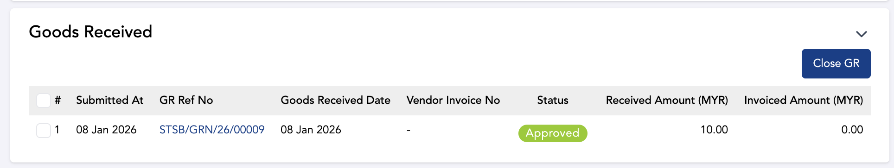 |
					  | **Disabled** |  |
				- DONE Enable Receiving Invoice Price Update
				- DONE Enable Goods Return
			- Advance Payment
				- DONE create mailing group
				- DONE check advance payment flow
			- EVA settings
				- DONE Notify Users when Vendor Uploads GR attachment
				- DONE Notify Users when Vendor Uploads Invoice
		- ### Form Listing Page
		  collapsed:: true
			- #re-test Form listing Page (deployed during Phase 1 of Multi PO)
				- DONE Create new Form
				- DONE History Logs
					- Form Creation
					  id:: 695e0094-fb6e-4486-b9f4-6fb715536c16
					- Form Deletion
					- Form Name Change
					- Form Details change
				- 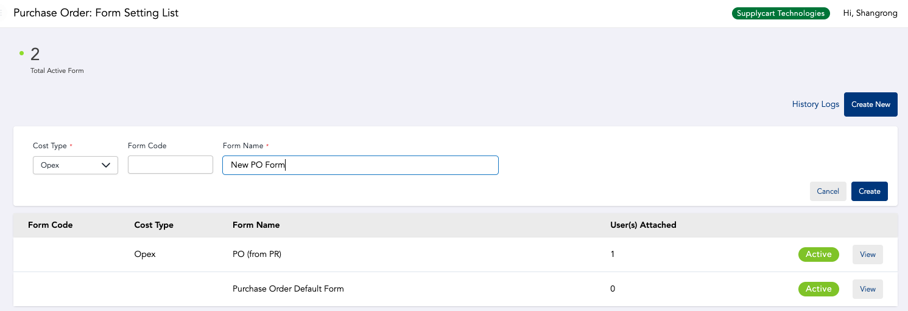{:height 269, :width 718}
		- ### Individual PO Form Setting
		  id:: 695e0e27-9809-42ad-9a50-64e67dc9a2db
			- Form Setting Tab
				- Move the below fields from ((695df31d-f53a-450c-8235-f4a73fe16036)) into ((695e0e27-9809-42ad-9a50-64e67dc9a2db))
					- TODO Auto PO #q&a
					  id:: 6966f4bd-3d8e-4235-89e0-6086e5821088
					  collapsed:: true
						- 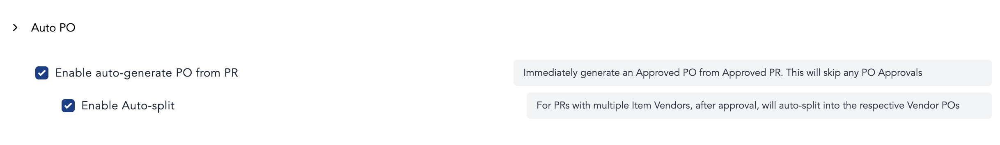
						- Setting key
						  id:: 695f4504-b56d-4123-9f41-8de373c2c547
							- id:: 695f450e-dd00-47d5-811b-1a042eeed348
							  | **FIELD** | **KEY** | **REMARKS** |
							  | --- | --- | --- |
							  | Enable auto-generate PO from PR | `purchase_requisition_enable_auto_generate_po_from_pr` | |
							  | Enable Auto-split | `purchase_requisition_enable_auto_split_po_from_pr` | |
					- TODO Auto PO Email #q&a
					  id:: 6966f4bd-5a34-4d87-8625-56e7ff13db5c
					  collapsed:: true
						- 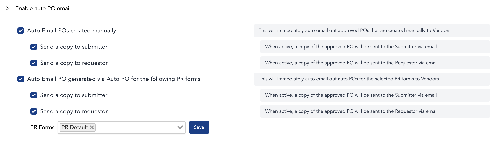
						- Setting key
							- | **FIELD** | **KEY** | **REMARKS** |
							  | --- | --- | --- |
							  | Enable auto PO email | `purchase_order_enable_auto_po` | This setting is not shown in UI |
							  | Auto Email POs created manually` | `purchase_order_enable_auto_email_auto_po` | |
							  | Send a copy to submitter | `purchase_order_auto_email_po_send_to_submitter` | |
							  | Send a copy to requestor | `purchase_order_auto_email_auto_po_send_to_requestor` | |
							  | Auto Email PO generated via Auto PO for the following PR forms | `purchase_order_enable_auto_email_auto_po`, `purchase_order_enable_auto_email_auto_po_forms` | |
							  | Send a copy to submitter | `purchase_order_auto_email_po_send_to_submitter` | |
							  | Send a copy to requestor | `purchase_order_auto_email_po_send_to_requestor` | |
						- Note
							- Add item from approved origin
							- Display assigned vendor
								-
					- TODO PO T&C #q&a
					  id:: 6966f4bd-c7e6-435c-86da-7b38aee28507
					  collapsed:: true
						- 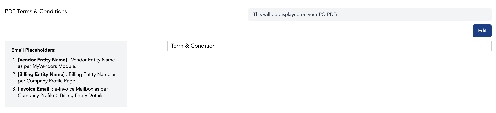
						- 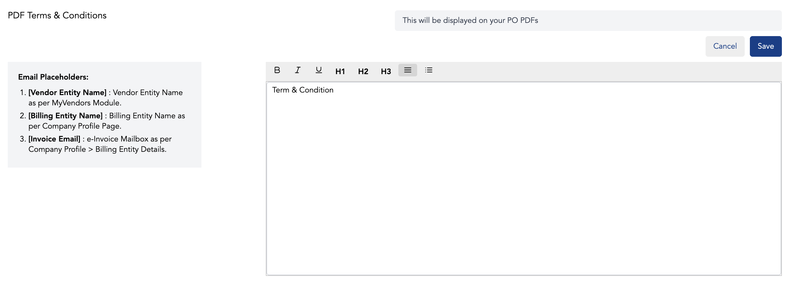
						- Setting key
							- | **FIELD** | **KEY** | **REMARKS** |
							  | --- | --- | --- |
							  | PDF Terms & Conditionsc | `purchase_requisition_tnc` | |
					- TODO PO Email Text #q&a
					  id:: 6966f4bd-08b8-4321-a3cb-4a74ba033488
					  collapsed:: true
						- 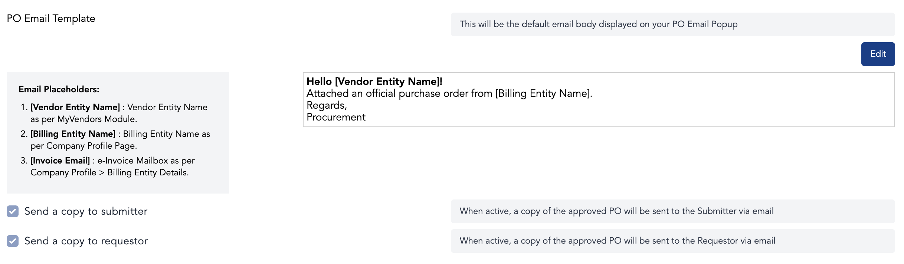
						- 
						- Setting key
							- | **FIELD** | **KEY** | **REMARKS** |
							  | --- | --- | --- |
							  | Send a copy to submitter | `purchase_order_email_default_send_to_submitter` | |
							  | Send a copy to requestor | `purchase_order_email_default_send_to_requestor` | |
			- Form Fields Tab
				- Part 1
					- #re-test Delivery Information
					- #re-test Vendor Information
					- #re-test Submission Information
					- #re-test Item information
					- Relabel Budget Setting (**Check JIRA Epic**)
					- Limit value based
						- add toggle to enable/disable
						- DONE Do we need to remove the SETTING PERMISSION from HUB? (2 possible answer) #q&a
							- Yes, we HUB to enable the config for this feature for that company
							  logseq.order-list-type:: number
							- No, Since we intend to allow customer to be able to toggle them by themselves we don't need HUB
							  logseq.order-list-type:: number
				- Part 2 - Item configuration
					- DONE Plan = split up all the grouped settings into each individual settings into modular #q&a
						- DONE **KIV** from @ben in what are the setting that we want to #q&a
						  :LOGBOOK:
						  CLOCK: [2026-01-15 Thu 16:10:31]--[2026-01-15 Thu 16:10:32] =>  00:00:01
						  :END:
					- DONE Add Item from approved origin #q&a
						- DONE Item Source: Contract Item
							- #q&a Not now
							- What does it do?
							- If it works the same way as `Vendor Pricing` config, should we still show the `Vendor Pricing` config?
			- #re-test PO PDF Tab
			- #re-test Setup Logs
- # Pending Tasks
	- DONE [[Company & Form Setting Setup]]
	- DONE [[Form Setting Splitting]]
	- TODO [[Reorganise PO Settings]] {{renderer :todomaster}}
		- DONE Form Listing Page
		- DONE Global PO Form Setting
		- TODO Individual PO Form Setting
			- Form Setting Tab
				- [Auto PO](logseq://graph/TODO?block-id=6966f4bd-3d8e-4235-89e0-6086e5821088)
					- FE
						- `<AutoPO />` component skeleton is done
					- BE
						- Save config into
						- **REFERENCE** {{embed ((6966f4bd-3d8e-4235-89e0-6086e5821088))}}
				- [Enable auto PO email](logseq://graph/TODO?block-id=6966f4bd-5a34-4d87-8625-56e7ff13db5c)
					- FE
						-
					- BE
						-
				- [PDF Terms & Conditions](logseq://graph/TODO?block-id=6966f4bd-c7e6-435c-86da-7b38aee28507)
					- FE
						-
					- BE
						- TODO make sure to save them within the `form_settings.values` column
							- ```json
							  {
							    ...
							    "template": {
							      "tnc": "T&C templates....",
							    }
							  }
							  ```
						-
				- [PO Email Template](logseq://graph/TODO?block-id=6966f4bd-08b8-4321-a3cb-4a74ba033488)
					- FE
					- BE
			- Form Fields Tab
				-