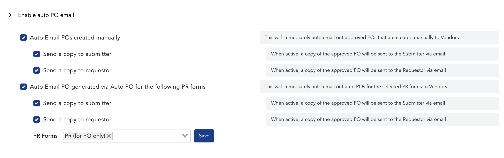
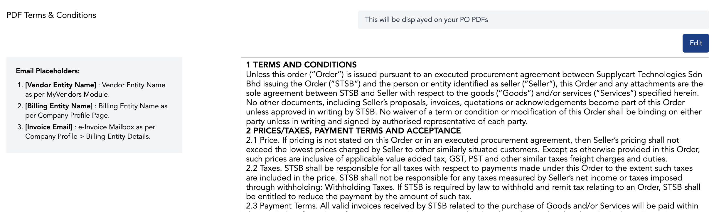
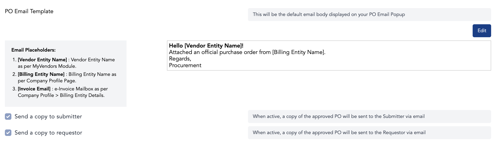

# Acceptance Criteria
	- [[Form Setting Splitting]]
	  logseq.order-list-type:: number
		- **Global PO Form Setting** page = The current `Purchase Order: Purchase Orders Settings` page
		- **Individual PO Form Setting** page = The page after user clicked on the `More Settings` from the `Purchase Order: Purchase Orders Settings` page
	- [[Reorganise PO Settings]]
	  logseq.order-list-type:: number
		- Some fields from **Global PO Form Setting** will be moved into **Individual PO Form Setting**
		  logseq.order-list-type:: number
-
- ## Q&A
	- What is the main difference between Global PO Setting & Individual PO Setting?
		- | Global PO Setting | Individual PO Setting |
		  | --- | ---- |
		  | Feature toggle will affect existing PO (live change) | Feature toggle will only affect newly drafted PO |
		  | Changes will be set under global Company Setting | Changes will be set under PO Form Setting |
-
- # Task Breakdown
	- ## [[Company & Form Setting Setup]] {{renderer :todomaster}}
	  collapsed:: true
		- #re-test **Hub/ADAM features page**
		  collapsed:: true
			- DONE #q&a Do we still need to add setting in HUB?
				- We already implemented the feature flag without using HUB at the moment
			- DONE #q&a What does it mean by this statement? **"Create new PO form setting (for switchover)"**
				- A: `switchover` here means when we switch from partial Multi PO implementation into full Multi PO implementation throughout **ADAM**
		- #re-test **Role & Permissions**
		  collapsed:: true
			- DONE #q&a The **"remain the same"** here means that all single PO's exis``ting permission applies to multi PO, right?
			  collapsed:: true
				- A: the **Remain the same** statement under the **Roles & Permissions** means that all Multi PO’s permission shares the same permission as existing Single PO
		- #re-test **User Form Assignment**
		  collapsed:: true
			- DONE we already implemented this in existing Multi PO & Single PO
	- ## [[Form Setting Splitting]] {{renderer :todomaster}}
	  collapsed:: true
		- ### Global PO Form Setting
			- #q&a From ticket `Context` section:
				- DONE What does **"for GROUPs"** & **PO Template** refers to?
				- ```
				  Context:
				  Previous understanding was that within a company, only ONE template for PO is ever used
				  
				  However, from our understanding, for GROUPs, each company may have a different PO template. Also, within a single company, there can be multiple PO types.
				  
				  For Lembaga Zakat Selangor, different PO types also have different approvals as some POs require management approvals, and others which have been pre-approved, can just be departmental approval
				  ```
				- A: Group here means that multi po will help in terms of making single po form setting to encapsulate different groups of companies' needs
		- ### Individual PO Form Setting
			- #re-test **PR** or **RFX** Form Settings can be routed to the different **PO** Form Settings
			  collapsed:: true
				- **PR**
					- TODO `Manual PR -> PO`
					- TODO `Auto PR -> PO`
				- **RFX**
					- TODO `RQ > RFX > PR`
					  id:: 695e10f2-48e5-49a3-8576-d02f932e6884
					- TODO `PR > RFX > PO`
			- #re-test Each PO will have GR & IR form attached
			  collapsed:: true
				- Answer to all the below questions:
					- it's not needed to add `Form Name` column for GR, RTN & PI moduel.
				- DONE #q&a We should add the `Form Name` column within both `Good Received (GR)` & `Purchase Invoice (PI) (PI)` similar to the `My Purchase Orders` & `Company Purchase Order` listing page
					- DONE If yes, then  Export Submission CSV should also be affected since we need to add a new column
					- DONE Seems like `PI` listing page does not have CSV export
				- DONE #q&a This will affect the search query within `GR` & `PI` listing page?
				- DONE #q&a Do we need to add filter dropdown for PO Form Setting within  `GR` & `PI` listing page?
				- DONE #q&a We should also apply the same thing within `Good Returns (GRN)` listing page including the filter & search function?
			- #re-test Each PO form can be revised or **issued** and sent to a different approval flow
			  collapsed:: true
				- DONE #q&a Does the word `issued` here are synonymous to `created` PO?
			- #re-test Create new Form
				- Type of PO form
			- #re-test History Logs
				- Form Creation
				- Form Deletion
				- Form Name Change
				- Form Details change
	- ## [[Reorganise PO Settings]] {{renderer :todomaster}}
		- ### Global PO Form Setting
		  id:: 695df31d-f53a-450c-8235-f4a73fe16036
			- #re-test Internal Source
			  collapsed:: true
				- DONE figure out how it work in BE
			- PO Acceptance
				- DONE #q&a Is this referring to a scenario where vendor is accepted?
				  collapsed:: true
					- A: yes
				- TODO For the “PO Acceptance“ feature, do we not need to separate them into it’s own individual PO setting?
					- `Tanya ben`
			- Enable Requestor to access PO Details
				- TODO #q&a Is this still used?
					- I guess it means that the user (in this case, I assume its the original submitter for RQ/PR/PO?) who created RQ should be able to access PO details even without **LOGIN** in 1s?
					- `Tanya ben` (maybe x pakai)
			- #re-test Revise & Edit PO
				- TODO Enable Revise PO
				- TODO Require Approval for Lower Revision Sum
					- What does revision sum means & how does it work?
				- TODO Enable Revise on POs that have GR activity on them
					- How does it work?
				- DOING Enable Edit PO
				  :LOGBOOK:
				  CLOCK: [2026-01-07 Wed 16:07:55]
				  :END:
			- #re-test Company PO Page filters
				- TODO check again with both @sim & @ben since we've implemented Filtering for `Form Name`
			- #re-test Closing Po
				- DONE Enable Goods Received Closing
				- DONE Enable Extra Receiving Quantity
					- | Toggle | Screenshot |
					  | --- | --- |
					  | **Enabled** | {:height 254, :width 531} |
					  | **Disabled** | {:height 168, :width 536} |
				- DONE Enable FOC Quantities
					- | Toggle | Screenshot |
					  | --- | --- |
					  | **Enabled** |  |
					  | **Disabled** |  |
				- DONE Enable Invoice Received Closing
					- | Toggle | Screenshot |
					  | --- | --- |
					  | **Enabled** |  |
					  | **Disabled** |  |
				- TODO Enable Receiving Invoice Price Update
				- TODO Enable Goods Return
			- Advance Payment
				- TODO create mailing group
				- TODO check advance payment flow
			- EVA settings
				- TODO Notify Users when Vendor Uploads GR attachment
				- TODO Notify Users when Vendor Uploads Invoice
		- ### Form Listing Page
			- #re-test Form listing Page (deployed during Phase 1 of Multi PO)
				- TODO Create new Form
				- TODO History Logs
					- Form Creation
					  id:: 695e0094-fb6e-4486-b9f4-6fb715536c16
					- Form Deletion
					- Form Name Change
					- Form Details change
				- {:height 269, :width 718}
		- ### Individual PO Form Setting
		  id:: 695e0e27-9809-42ad-9a50-64e67dc9a2db
			- Form Setting Tab
				- Move the below fields from ((695df31d-f53a-450c-8235-f4a73fe16036)) into ((695e0e27-9809-42ad-9a50-64e67dc9a2db))
				- TODO Auto PO
					- 
					- Setting key
					  id:: 695f4504-b56d-4123-9f41-8de373c2c547
						- id:: 695f450e-dd00-47d5-811b-1a042eeed348
						  | **FIELD** | **KEY** | **REMARKS** |
						  | --- | --- | --- |
						  | Enable auto-generate PO from PR | `purchase_requisition_enable_auto_generate_po_from_pr` | |
						  | Enable Auto-split | `purchase_requisition_enable_auto_split_po_from_pr` | |
				- TODO Auto PO Email
					- 
					- Setting key
						- | **FIELD** | **KEY** | **REMARKS** |
						  | --- | --- | --- |
						  | Auto Email POs created manually` | `purchase_order_enable_auto_email_auto_po` | |
						  | Send a copy to submitter | `` | |
						  | Send a copy to requestor | `` | |
						  | Auto Email PO generated via Auto PO for the following PR forms | `` | |
						  | Send a copy to submitter | `` | |
						  | Send a copy to requestor | `` | |
				- TODO PO T&C
					- 
					- Setting key
						- | **FIELD** | **KEY** | **REMARKS** |
						  | --- | --- | --- |
						  | PDF Terms & Conditions | `` | |
				- TODO PO Email Text
					- 
					- Setting key
						- | **FIELD** | **KEY** | **REMARKS** |
						  | --- | --- | --- |
						  | Send a copy to submitter | `` | |
						  | Send a copy to requestor | `` | |
			- #re-test Form Fields Tab
				- #re-test Delivery Information
				- #re-test Vendor Information
				- #re-test Submission Information
				- #re-test Item information
			- #re-test PO PDF Tab
			- #re-test Setup Logs