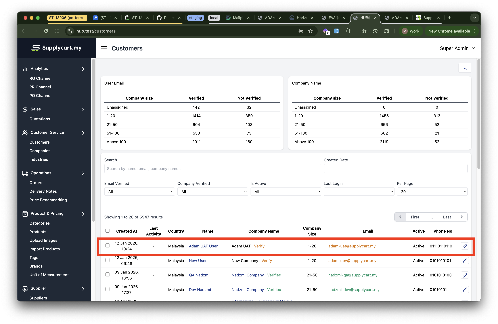
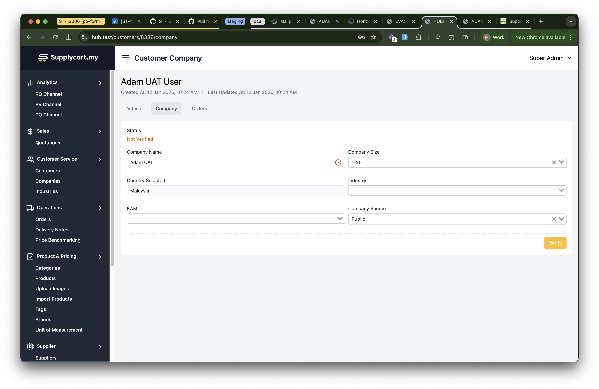
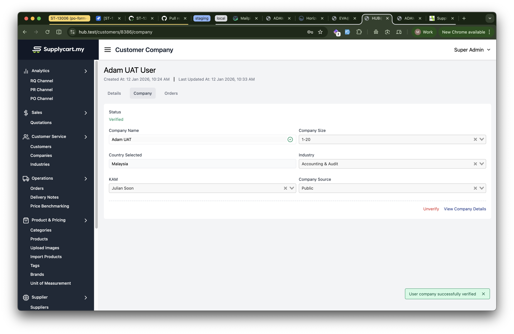
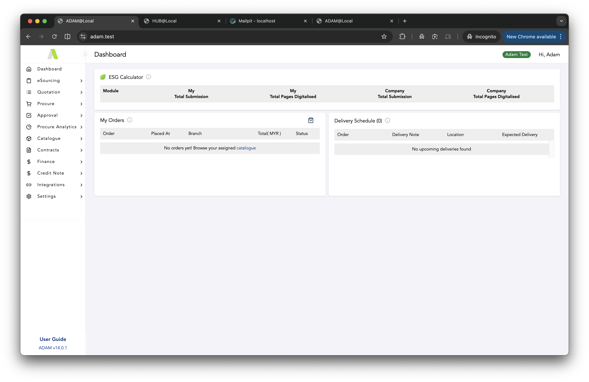

# Objective
	- To show step by step how to create a new Company in Adam
- # Pre-requisite
	- Adam & Hub is operational & running
	- The webhook integration between Adam & Hub is operational & running
- # Step by step instruction
	- In Adam, go to this route `https://<DOMAIN URL>/nomoresignupforyou` and submit the form.
	  logseq.order-list-type:: number
		- {:height 535, :width 810}
	- Once submitted, you need to verify the new company first before verifying your new customer user. To verify your company, sign in to Hub. You should see your new company in the `Customer Service > Customers` page.
	  logseq.order-list-type:: number
		- 
	- Proceed to verify your company by clicking the `Verify` button in `Customer Company` page
	  logseq.order-list-type:: number
		- 
		- 
	- Then, to verify your new customer user, check your email inbox for the verification link.
	  logseq.order-list-type:: number
		- 
	- Clicking the `Verify Email Address` should automatically verify your email & re-direct you to Adam as your new customer user.
	  logseq.order-list-type:: number
		- 
	- In case you haven't verified your company, it may re-direct you to the `Verify Your email Address` page. So, make sure to verify / re-verify your company in Hub again & click on the `Resend Link` to get a new customer user link.
	  logseq.order-list-type:: number
		- 
	- logseq.order-list-type:: number