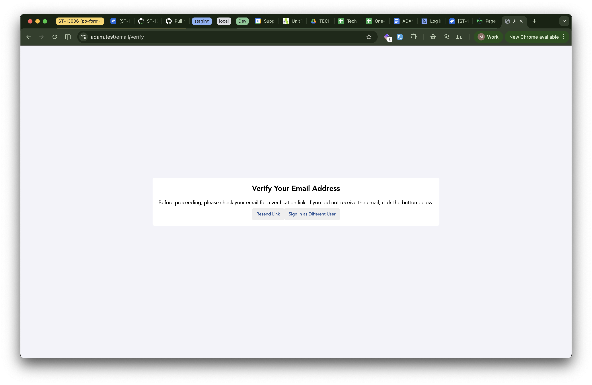

# Objective
	- To show step by step how to create a new Company in Adam
- # Pre-requisite
	- Adam & Hub is operational & running
	- The webhook integration between Adam & Hub is operational & running
- # Step by step instruction
	- In Adam, go to this route `https://<DOMAIN URL>/nomoresignupforyou` and submit the form
	  logseq.order-list-type:: number
		- {:height 535, :width 810}
	- Once submitted, it may re-direct you to `https://adam-procure.com/`, but you should go back into Adam & login using the new user credential
	  logseq.order-list-type:: number
	- It should give the below screen. Click `Sign In as Different User` to continue sign in as your new Adam user.
	  logseq.order-list-type:: number
		- 
	- Proce
	  logseq.order-list-type:: number
	- Once you select the `Sign In as Different User`, you should be back to the login page. Proceed to submit the login form using your new Adam user.
	  logseq.order-list-type:: number
		- logseq.order-list-type:: number