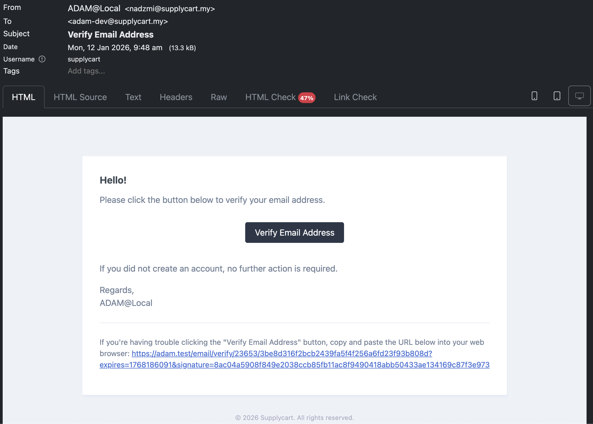

# Objective
	- To show step by step how to create a new Company in Adam
- # Pre-requisite
	- Adam & Hub is operational & running
	- The webhook integration between Adam & Hub is operational & running
- # Step by step instruction
	- In Adam, go to this route `https://<DOMAIN URL>/nomoresignupforyou` and submit the form
	  logseq.order-list-type:: number
		- {:height 535, :width 810}
	- Once submitted, sign in to Hub. You should see your new company in the `Customer Service > Customers` page.
	  logseq.order-list-type:: number
		-
	- Check your email inbox in order to verify your email.
	  logseq.order-list-type:: number
		- 
	- logseq.order-list-type:: number
	- Go back to Adam & click `Sign In as Different User` to continue sign in as your new Adam user.
	  logseq.order-list-type:: number
		- 
	- logseq.order-list-type:: number